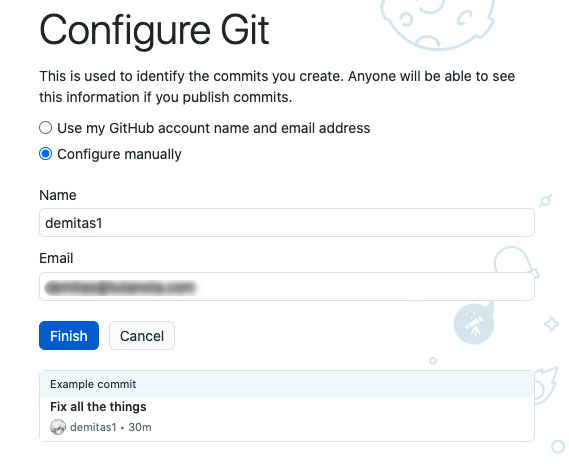
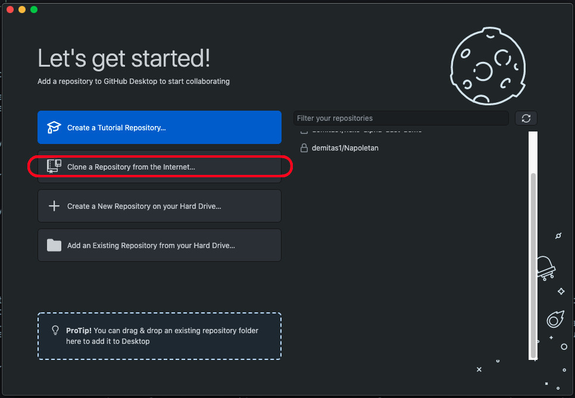
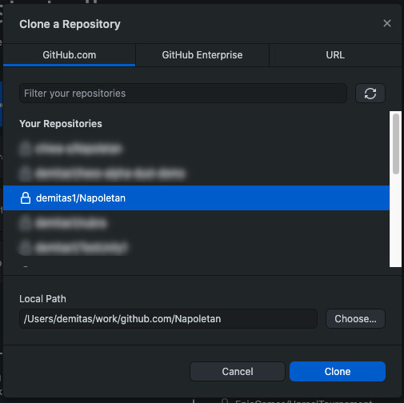
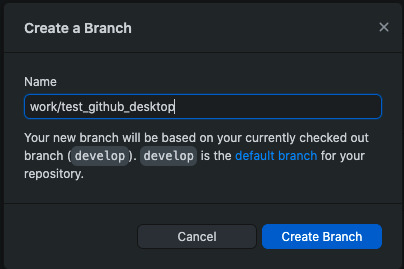
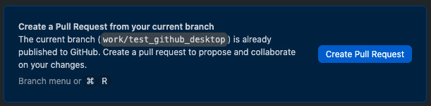
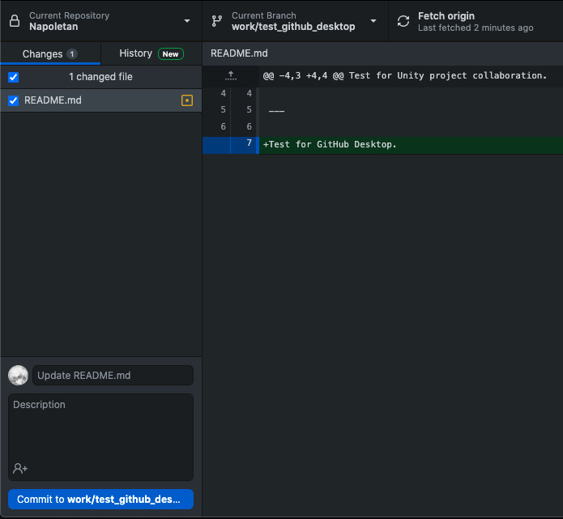
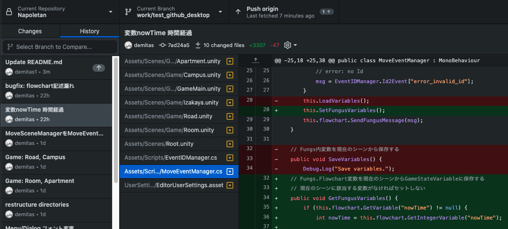
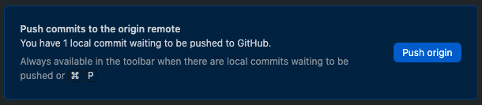
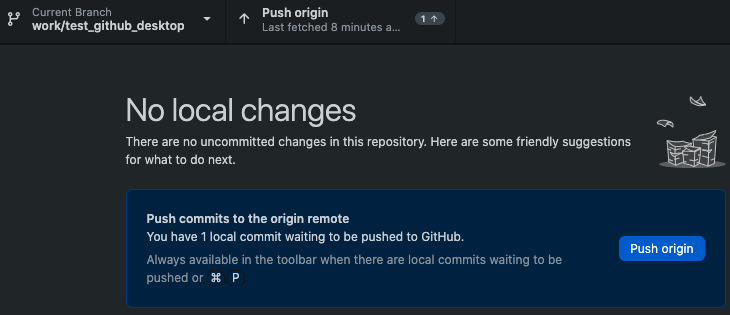
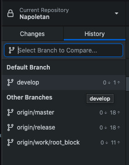

# Napoletan Dev document

## Gitについて

Gitの基本については、このあたりを参考にしてください。

[サル先生のGit入門](https://backlog.com/ja/git-tutorial/)

[Gitのインストール](https://backlog.com/ja/git-tutorial/intro/05/)

[初期設定](https://backlog.com/ja/git-tutorial/intro/06/)

[リモートリポジトリをクローンする](https://backlog.com/ja/git-tutorial/intro/10/)

[リモートリポジトリからプルする](https://backlog.com/ja/git-tutorial/intro/11/)

[リモートリポジトリにプッシュする](https://backlog.com/ja/git-tutorial/intro/09/)

[ブランチとは](https://backlog.com/ja/git-tutorial/stepup/01/)

[ブランチを作成する](https://backlog.com/ja/git-tutorial/stepup/07/)

[ブランチを切り替える](https://backlog.com/ja/git-tutorial/stepup/08/)

[開発ブランチで修正](https://backlog.com/ja/git-tutorial/pull-request/05/)

[プルリクエストの作成](https://backlog.com/ja/git-tutorial/pull-request/06/)

## ノベルゲー開発でのGitの使い方

### 開発用のコードをダウンロードする（clone）

Cloneの操作は最初に１回だけ行います.

1. Cloneしてリポジトリをローカルに持ってくる

```
git clone https://github.com/demitas1/Napoletan.git
```

2. UnityHubからプロジェクトをADDする

(put screen image)


### 最新の共有コードを取り込む（pull）

```
git checkout develop

git pull origin develop
```

### コードに変更を行う（branch + checkout + commit）

- 作業用のブランチを作る

```
git branch work/my_working_branch
git checkout work/my_working_branch
```

- UnityEditorで動作確認しながら変更を加える

- 変更が完了したら、変更ファイルを確認

```
git status
```

- 変更をコミットする

コミットの準備

```
git add -u
```

新規に追加したファイルがある場合はそれも追加

```
git add newFile
```

作業ブランチにコミット

```
git commit -m "変更についての簡単な見出し"
```

### 作成したコードをアップロードする（push）

作業ブランチをリモートにプッシュする

```
git push -u origin work/my_working_branch
```


## image test


---


---


---


---


---


---


---


---


---


---


---


---


---


---


---


---


---


---


---

<div>

</div>
---


---

